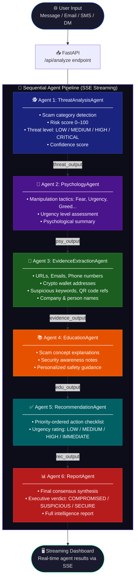

<div align="center">


# 🛡️ SOCIAL SHIELD AI

### *Multi-Agent Threat Intelligence System for Social Engineering Detection*

> **Social Shield AI** is an AI-powered cybersecurity platform that analyzes messages (emails, SMS, DMs, job offers, etc.) through a sequential pipeline of 6 specialized AI agents powered by **Google Gemini**. It detects scams, extracts forensic evidence, profiles psychological manipulation, and generates actionable security reports — all in real time via a beautiful streaming dashboard.

</div>

---

## 📌 Table of Contents

- [✨ Features](#-features)
- [🏗️ System Architecture](#️-system-architecture)
- [🔄 Multi-Agent Pipeline Flow](#-multi-agent-pipeline-flow)
- [🤖 The 6 AI Agents](#-the-6-ai-agents)
- [🗂️ Project Structure](#️-project-structure)
- [⚙️ Tech Stack](#️-tech-stack)
- [🚀 Getting Started](#-getting-started)
- [🔌 API Reference](#-api-reference)
- [🖥️ Screenshots](#️-screenshots)
- [🤝 Contributing](#-contributing)

---

## ✨ Features

| Feature | Description |
|---|---|
| 🔍 **Threat Classification** | Detects Phishing, OTP Scams, Romance Scams, Fake Jobs, Investment Fraud & more |
| 🧠 **Psychology Profiling** | Identifies Fear, Urgency, Greed, Authority & other manipulation tactics |
| 🔎 **Forensic Evidence Extraction** | Extracts URLs, emails, phones, crypto wallets, suspicious keywords |
| 📚 **Education Module** | Explains scam concepts with safety tips personalized to the threat |
| ✅ **Actionable Recommendations** | Priority-ordered security checklist with urgency rating |
| 📊 **Consensus Intelligence Report** | Final synthesized verdict: COMPROMISED / SUSPICIOUS / SECURE |
| ⚡ **Real-time Streaming** | Server-Sent Events (SSE) stream agent progress live to the UI |
| 🌐 **Multi-Source Support** | EMAIL, SMS, IM_CHAT, SOCIAL_DM, JOB_OFFER, SCREENSHOT_OCR |

---

## 🏗️ System Architecture

```
┌─────────────────────────────────────────────────────────────┐
│                     CLIENT (Browser)                        │
│          Vite + Vanilla JS + Streaming Dashboard            │
└─────────────────────┬───────────────────────────────────────┘
                      │  POST /api/analyze  (SSE Stream)
                      ▼
┌─────────────────────────────────────────────────────────────┐
│                  FastAPI Backend (Python)                    │
│                                                             │
│   ┌─────────────────────────────────────────────────────┐   │
│   │              PIPELINE ORCHESTRATOR                  │   │
│   │                                                     │   │
│   │  Agent 1 → Agent 2 → Agent 3 → Agent 4 →           │   │
│   │  Agent 5 → Agent 6 → Final Report (SSE emit)        │   │
│   └─────────────────────────────────────────────────────┘   │
│                                                             │
└──────────────────────────┬──────────────────────────────────┘
                           │
                           ▼
           ┌───────────────────────────────┐
           │       Google Gemini API       │
           │    (gemini-1.5-flash model)   │
           └───────────────────────────────┘
```

---

## 🔄 Multi-Agent Pipeline Flow



---

## 🤖 The 6 AI Agents

Each agent is a specialized **Google Gemini** prompt with a strict **Pydantic JSON output schema**, ensuring type-safe, structured, and chained outputs.

### 1. 🕵️ ThreatAnalysisAgent
Classifies the scam type and calculates a risk score.
- **Input:** Source type, sender, subject, message body
- **Output:** `scam_category`, `risk_score` (0–100), `threat_level`, `confidence`, `reasoning`
- **Detects:** Phishing, Fake Job Scam, OTP Scam, Romance Scam, Impersonation, Investment Fraud

### 2. 🧠 PsychologyAgent
Profiles psychological manipulation tactics used in the message.
- **Input:** Message body + ThreatOutput
- **Output:** `manipulation_tactics[]`, `urgency_level`, `overall_manipulation_summary`
- **Tactics Detected:** Fear, Urgency, Scarcity, Authority, Curiosity, Greed, Social Proof

### 3. 🔬 EvidenceExtractionAgent
Extracts forensic artifacts and Indicators of Compromise (IoCs).
- **Input:** Message body + ThreatOutput + PsychologyOutput
- **Output:** `urls`, `emails`, `phones`, `crypto_wallets`, `companies`, `persons`, `suspicious_keywords`, `qr_references`

### 4. 📚 EducationAgent
Generates educational security awareness content tailored to the detected threat.
- **Input:** Message body + ThreatOutput + EvidenceOutput
- **Output:** `scam_concepts[]`, `explanation`

### 5. ✅ RecommendationAgent
Compiles a prioritized action checklist for the user.
- **Input:** ThreatOutput + PsychologyOutput + EvidenceOutput
- **Output:** `action_items[]`, `urgency_rating`
- **Actions include:** Block sender, report to authorities, contact bank, enable MFA

### 6. 📊 ReportAgent
Synthesizes all agent outputs into a final consensus intelligence report.
- **Input:** All 5 previous agent outputs
- **Output:** `threat_summary`, `final_verdict`, `risk_score`, `recommendations[]`, full evidence map

---

## 🗂️ Project Structure

```
SOCIAL-SHIELD-AI/
│
├── 📄 index.html              # Frontend entry point
├── 🎨 style.css               # UI styles
├── ⚡ app.js                  # Frontend logic & SSE client
├── 📦 package.json            # Node/Vite config
│
└── 🐍 backend/
    ├── main.py                # FastAPI app, CORS, endpoints
    ├── pipeline.py            # 6-agent sequential orchestrator
    ├── schemas.py             # Pydantic models for all agents
    ├── config.py              # Settings (API key, model, port)
    ├── requirements.txt       # Python dependencies
    ├── .env.example           # Environment variable template
    │
    └── agents/
        ├── base_agent.py      # Base class: Gemini API call + JSON parsing
        ├── threat_agent.py    # Agent 1: Threat classification
        ├── psychology_agent.py# Agent 2: Manipulation profiling
        ├── evidence_agent.py  # Agent 3: IoC extraction
        ├── education_agent.py # Agent 4: Security education
        ├── recommendation_agent.py # Agent 5: Action checklist
        └── report_agent.py    # Agent 6: Final report synthesis
```

---

## ⚙️ Tech Stack

| Layer | Technology |
|---|---|
| **Frontend** | HTML5, CSS3, Vanilla JavaScript, Vite |
| **Backend** | Python 3.11+, FastAPI, Uvicorn |
| **AI Engine** | Google Gemini API (`gemini-1.5-flash`) |
| **Data Validation** | Pydantic v2, pydantic-settings |
| **Streaming** | Server-Sent Events (SSE) |
| **Config** | python-dotenv |

---

## 🚀 Getting Started

### Prerequisites

- **Node.js** v18+ (for frontend)
- **Python** 3.11+ (for backend)
- A **Google Gemini API Key** → [Get one here](https://aistudio.google.com/app/apikey)

---

### 1️⃣ Clone the Repository

```bash
git clone https://github.com/Abhidharose/SOCIAL-SHIELD-AI.git
cd SOCIAL-SHIELD-AI
```

---

### 2️⃣ Backend Setup

```bash
# Navigate to backend
cd backend

# Create and activate virtual environment
python -m venv venv

# On Windows:
venv\Scripts\activate
# On macOS/Linux:
source venv/bin/activate

# Install dependencies
pip install -r requirements.txt

# Configure environment variables
cp .env.example .env
```

Edit `backend/.env` and add your API key:

```env
GEMINI_API_KEY=your_google_gemini_api_key_here
GEMINI_MODEL=gemini-1.5-flash
BACKEND_PORT=8000
```

Start the backend server:

```bash
# From the project root directory
uvicorn backend.main:app --reload --port 8000
```

Backend will be available at: `http://localhost:8000`

---

### 3️⃣ Frontend Setup

Open a **new terminal** in the project root:

```bash
# Install frontend dependencies
npm install

# Start the development server
npm run dev
```

Frontend will be available at: `http://localhost:5173`

---

### 4️⃣ Verify Everything Works

```bash
curl http://localhost:8000/api/health
```

Expected response:
```json
{
  "status": "healthy",
  "gemini_api_key_configured": true,
  "model": "gemini-1.5-flash",
  "message": "SocialShield AI Agent Backend is operational."
}
```

---

## 🔌 API Reference

### `GET /api/health`
Health check endpoint. Verifies backend status and API key configuration.

**Response:**
```json
{
  "status": "healthy",
  "gemini_api_key_configured": true,
  "model": "gemini-1.5-flash",
  "message": "SocialShield AI Agent Backend is operational."
}
```

---

### `POST /api/analyze`
Starts the 6-agent pipeline for a given message. Returns a **Server-Sent Events (SSE)** stream.

**Request Body:**
```json
{
  "source_type": "EMAIL",
  "sender": "no-reply@paypa1-secure.xyz",
  "subject": "Your account has been suspended!",
  "body": "Dear customer, your PayPal account has been suspended. Click here to verify: http://paypa1-login.xyz"
}
```

**Supported `source_type` values:**
| Value | Description |
|---|---|
| `EMAIL` | Email message |
| `SMS` | Text message |
| `IM_CHAT` | Instant messaging chat |
| `SOCIAL_DM` | Social media direct message |
| `JOB_OFFER` | Job offer message |
| `SCREENSHOT_OCR` | OCR-extracted text from screenshot |

**SSE Event Stream:**

| Event | Description |
|---|---|
| `agent_start` | Agent has begun processing |
| `agent_done` | Agent has completed with results |
| `pipeline_complete` | Full pipeline finished with final result |
| `error` | An error occurred during pipeline |

**Example SSE Events:**
```
event: agent_start
data: {"agent": "ThreatAnalysisAgent", "message": "Classifying threat type..."}

event: agent_done
data: {"agent": "ThreatAnalysisAgent", "scam_category": "Phishing", "risk_score": 92, "threat_level": "CRITICAL", "confidence": 0.97, "reasoning": "..."}

event: pipeline_complete
data: {"session_id": "SS-1719456789123", "source_type": "EMAIL", "final_report": {...}}
```

---

## 🖥️ Screenshots

> 🖥️ **Live Dashboard** — Real-time multi-agent analysis with streaming results

> 📊 **Intelligence Report** — Final consensus verdict with risk score, evidence map, and recommendations

---

## 🔐 Security Notes

- ⚠️ **Never commit your `.env` file** — it is listed in `.gitignore`
- Your `GEMINI_API_KEY` stays local and is never sent to the frontend
- The `.env.example` file is provided as a safe template

---

## 🤝 Contributing

Contributions are welcome! If you have ideas for new agents, improved prompts, or UI improvements:

1. Fork the repository
2. Create a feature branch: `git checkout -b feature/new-agent`
3. Commit your changes: `git commit -m "Add new agent"`
4. Push to the branch: `git push origin feature/new-agent`
5. Open a Pull Request

---

## 📄 License

This project is licensed under the **MIT License**.

---

<div align="center">

**Built with ❤️ by [Abhidharose](https://github.com/Abhidharose)**

*Social Shield AI — Protecting people from social engineering, one message at a time.*

⭐ **If you find this project useful, please give it a star!** ⭐

</div>
